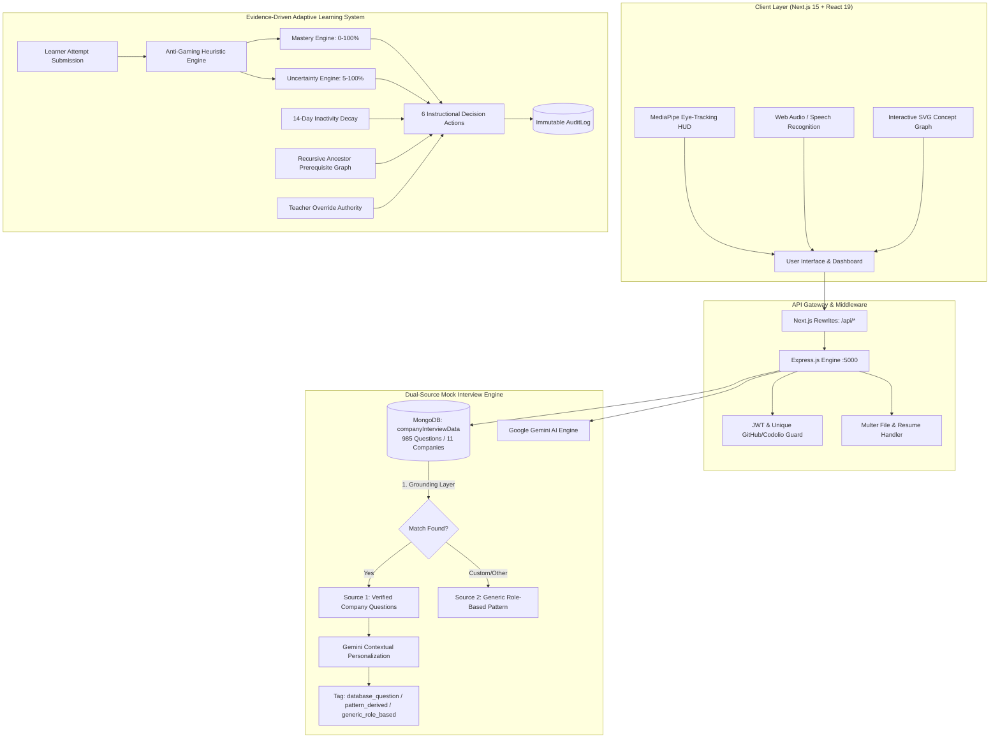

# CareerTwin AI 2.0

<div align="center">


<br/>

> **"Don't just prepare for interviews. Build your career with an AI that grows with you."**

[](https://nextjs.org/)
[](https://react.dev/)
[](https://www.typescriptlang.org/)
[](https://tailwindcss.com/)
[](https://nodejs.org/)
[](https://expressjs.com/)
[](https://www.mongodb.com/)
[](https://aistudio.google.com/)
[](https://developers.google.com/mediapipe)
[](LICENSE)

</div>

---

## 📖 Executive Summary

**CareerTwin AI** is a privacy-first, evidence-driven career intelligence platform engineered for aspiring software engineers, students, and tech professionals. Unlike generic conversational chatbots that offer superficial practice, CareerTwin constructs an evolving **Digital Career Twin** that aggregates verified coding proficiency, authentic company interview datasets, real-time eye-contact & speech telemetry, and structured knowledge graphs.

### Core Breakthroughs
* **Dual-Source Interview Grounding:** Grounded in a curated database of **985 verified interview questions across 11 top companies**, personalized dynamically using Google Gemini AI.
* **Computer Vision HUD:** Live camera overlay measuring **eye contact percentage**, gaze tracking (`focused`, `drifting`, `away`), and facial presence using MediaPipe.
* **Evidence-Driven Adaptive Learning System:** 12-concept bounded Knowledge Graph with 15 prerequisite edges, anti-gaming heuristic penalties, 14-day decay tracking, and 6 instructional decision actions.
* **Teacher Governance Oversight:** Cohort telemetry, safety intervention alerts, and mandatory pedagogical override rationale enforced with an immutable audit trail.
* **Cross-Platform Verification:** Real-time competitive coding profile synchronization (LeetCode, CodeChef, Codeforces via **Codolio**) and GitHub commit signals with account anti-sharing constraints.
* **Dual-Engine Resume & CV Analyzer:** Deep integration of the live interactive Vercel CV Analyzer with CareerTwin's MongoDB ATS keyword parser.

---

## 🚀 Live Localhost Navigation

When running locally, access all features directly through the following links:

### 1. Modern Next.js 15 Client (Port 3000)

| Module | URL | Description |
|---|---|---|
| **Landing Page** | [http://localhost:3000](http://localhost:3000) | Platform showcase, feature highlights, and onboarding |
| **Command Central Dashboard** | [http://localhost:3000/dashboard](http://localhost:3000/dashboard) | Career Readiness score dial, Adaptive Learning Action Hero, 12-concept pipeline |
| **Mock Interview & Eye HUD** | [http://localhost:3000/interview](http://localhost:3000/interview) | Dual-source grounded interview room, live camera gaze tracking & speech input |
| **Resume & CV Analyzer** | [http://localhost:3000/resume](http://localhost:3000/resume) | Dual-engine: Live Vercel CV Analyzer + CareerTwin ATS skills extractor |
| **Adaptive Concept Graph** | [http://localhost:3000/adaptive/concept-graph](http://localhost:3000/adaptive/concept-graph) | Interactive 12-concept SVG dependency graph & prerequisite inspector |
| **Mastery & Epistemic Uncertainty** | [http://localhost:3000/adaptive/mastery](http://localhost:3000/adaptive/mastery) | Dual metric tracking (Mastery vs Uncertainty) across all 12 concepts |
| **Teacher Governance Dashboard** | [http://localhost:3000/adaptive/teacher-dashboard](http://localhost:3000/adaptive/teacher-dashboard) | Cohort telemetry, bottleneck alerts, and mandatory pedagogical overrides |
| **Digital Career Twin 360°** | [http://localhost:3000/career-twin](http://localhost:3000/career-twin) | Evidence dimension breakdown, verified skills matrix, prioritized gap tasks |
| **User Sign-In** | [http://localhost:3000/login](http://localhost:3000/login) | JWT authentication with session persistence |
| **User Registration** | [http://localhost:3000/register](http://localhost:3000/register) | Account creation with unique GitHub & Codolio constraints |
| **Privacy & Settings** | [http://localhost:3000/settings](http://localhost:3000/settings) | Export Career Twin JSON, reset memory, permanent account wipe |

### 2. Express Backend & API Services (Port 5000)

| Service | URL | Description |
|---|---|---|
| **API Base Health Check** | [http://localhost:5000/api](http://localhost:5000/api) | Express API entrypoint & health check |
| **Company Interviews API** | [http://localhost:5000/api/company-interviews](http://localhost:5000/api/company-interviews) | Curated 11-company dataset metadata and question counts |
| **Amazon Interview Dataset** | [http://localhost:5000/api/company-interviews/Amazon](http://localhost:5000/api/company-interviews/Amazon) | 75 verified Amazon questions with category breakdown |
| **Static Mock Interview Room** | [http://localhost:5000/interview.html](http://localhost:5000/interview.html) | Vanilla JS mock interview room with MediaPipe & speech API |
| **Static Central Dashboard** | [http://localhost:5000/dashboard.html](http://localhost:5000/dashboard.html) | Vanilla JS dashboard with interactive attempt modal |
| **Static Concept Graph** | [http://localhost:5000/concept-graph.html](http://localhost:5000/concept-graph.html) | Vanilla JS SVG concept dependency graph |
| **Dual-Learner Simulation** | [http://localhost:5000/simulation.html](http://localhost:5000/simulation.html) | Side-by-side simulation (The Gambler vs The Master) + 6 Stress Tests |
| **Learning & Audit History** | [http://localhost:5000/learning-history.html](http://localhost:5000/learning-history.html) | Full chronological audit log of attempts and anti-gaming flags |

---

## 🏛️ System Architecture



---

## 🏢 Company Interview Database (985 Questions)

The system is grounded in an authentic, verified repository of company-wise interview questions parsed across **11 major tech employers**:

| Company | Total Questions | Primary Categorized Domains |
|---|---|---|
| **Google** | 50 | Data Structures, Algorithms, System Design, Problem Solving |
| **Amazon** | 75 | Leadership Principles, Behavioral, DSA, Scalability, Distributed Systems |
| **Microsoft** | 80 | Algorithms, OOP, Low-Level System Design, OS, DBMS |
| **Zoho** | 80 | C/Java Programming, Logic Puzzles, Problem Solving, OOP, Relational DBMS |
| **Apple** | 100 | Systems Architecture, Low-Level Concurrency, Memory Management, DSA |
| **Meta** | 100 | Distributed Systems, Scalability, High-Frequency DSA, Behavioral |
| **Infosys** | 100 | Core Programming, OOP, SQL/DBMS, Computer Networks, HR |
| **TCS** | 100 | Technical Fundamentals, DBMS, OOP, Software Testing, Core CS |
| **Adobe** | 100 | Complex Algorithms, Graphics Math, Memory Optimization, DSA |
| **Atlassian** | 100 | System Design, Clean Code, Agile Collaboration, Core Values |
| **High-Growth Startup** | 100 | Full-Stack Architecture, Rapid Prototyping, Scalability, Debugging |
| **Total** | **985 Questions** | **18 Normalized Categories** |

### Question Source Attribution Badges
Every question generated and reviewed is tagged with a transparent origin indicator:
* `🏢 Database Question`: Exact or minimally adapted question from the verified company collection.
* `🧬 Pattern-Derived`: Generated by Gemini AI adhering strictly to the verified questioning style of that company.
* `🎯 Role-Based`: General role-based question used when selecting an uncatalogued custom organization.

---

## 🧠 Evidence-Driven Adaptive Learning Engine

Structured around a bounded **Java Programming Fundamentals Knowledge Graph**:
* **12 Directed Concepts:**
  1. `Variables & Data Types`
  2. `Operators & Expressions`
  3. `Control Flow & Conditionals`
  4. `Loops & Iteration`
  5. `Methods & Scope`
  6. `Arrays & String Manipulation`
  7. `OOP Basics & Class Architecture`
  8. `Inheritance & Method Overriding`
  9. `Polymorphism & Dynamic Dispatch`
  10. `Interfaces & Abstraction`
  11. `Exception Handling & Robustness`
  12. `Java Collections Framework`
* **15 Directed Prerequisite Edges:** Traversed recursively to isolate root conceptual blockers when a candidate struggles.
* **Dual Epistemic Metrics:**
  * **Mastery (0–100%):** Heuristic competency calculation with strict upward jump caps (+12% maximum per attempt) to prevent artificial score spikes.
  * **Epistemic Uncertainty (5–100%):** Measures system confidence; lowered only through diverse question formats (Code Output, Debugging, Transfer Scenarios).
* **Anti-Gaming Shield:** Penalizes rapid guessing (`<5s` response times), guess-until-correct cycles, and hint-reliance.
* **6 Instructional Decisions:** `ADVANCE`, `PRACTICE`, `REVIEW`, `REMEDIATE_PREREQUISITE`, `CHALLENGE`, `TEACHER_INTERVENTION`.
* **Teacher Governance:** Cohort monitoring with teacher override authority requiring mandatory written pedagogical rationale, logged permanently in an immutable audit trail.

---

## 🛠️ Technology Stack

| Layer | Technologies |
|---|---|
| **Frontend Framework** | **Next.js 15 (Turbopack)**, **React 19**, **TypeScript** |
| **Styling & Icons** | **Tailwind CSS v4**, **Lucide React**, **canvas-confetti** |
| **Static Suite** | HTML5, Modern CSS3, Vanilla ES6+ JavaScript, Chart.js |
| **Backend API** | **Node.js 24**, **Express.js 4.21**, **Mongoose 8** |
| **Database** | **MongoDB Atlas** (Sharded Cluster) |
| **AI Engine** | **Google Gemini API** (`gemini-1.5-flash` / `gemini-1.5-pro`) |
| **Speech Intelligence** | Whisper API, Web Audio API, MediaRecorder |
| **Vision Intelligence** | MediaPipe FaceMesh & Eye Contact Gaze Estimator |
| **Authentication** | JSON Web Tokens (JWT), bcryptjs password hashing |
| **File Processing** | Multer, pdf-parse (PDF Resume parsing) |

---

## 📁 Repository Directory Structure

```
CareerTwin-AI/
├── client/                               # Next.js 15 + React 19 Modern Frontend
│   ├── src/
│   │   ├── app/
│   │   │   ├── page.tsx                  # Home Landing page
│   │   │   ├── login/page.tsx            # Candidate Sign-In
│   │   │   ├── register/page.tsx         # Sign-Up with GitHub & Codolio constraints
│   │   │   ├── dashboard/page.tsx        # Command Central Dashboard
│   │   │   ├── interview/
│   │   │   │   ├── page.tsx              # Dual-Source Mock Interview Room
│   │   │   │   └── report/[id]/page.tsx  # Deep Analysis Post-Interview Report
│   │   │   ├── resume/page.tsx           # Dual-Engine Resume & CV Analyzer
│   │   │   ├── adaptive/
│   │   │   │   ├── concept-graph/page.tsx # Interactive SVG Concept Graph
│   │   │   │   ├── mastery/page.tsx       # Mastery & Uncertainty Metrics
│   │   │   │   └── teacher-dashboard/page.tsx # Teacher Oversight & Overrides
│   │   │   ├── career-twin/page.tsx      # Digital Career Twin 360°
│   │   │   └── settings/page.tsx         # Privacy, JSON Export & Account Wipe
│   │   ├── components/                   # Reusable React 19 UI Primitives
│   │   │   ├── Navbar.tsx                # Responsive navigation header
│   │   │   ├── ScoreDial.tsx             # Radial SVG score gauge
│   │   │   ├── CompanyKnowledgeCard.tsx  # Company question dataset status card
│   │   │   ├── SourceTypeBadge.tsx       # Grounding source badge with tooltip
│   │   │   └── EyeTrackingHUD.tsx        # Camera overlay with real-time gaze HUD
│   │   ├── context/
│   │   │   └── AuthContext.tsx           # Client authentication state provider
│   │   ├── lib/
│   │   │   ├── api.ts                    # Central API client with JWT attachment
│   │   │   └── utils.ts                  # Formatters & class merge utilities
│   │   └── types/
│   │       └── index.ts                  # TypeScript domain interfaces
│   ├── next.config.ts                    # API proxy rewrites to Express backend
│   └── package.json
│
├── backend/                              # Express.js API Backend
│   ├── server.js                         # Application entrypoint & middleware
│   ├── config/db.js                      # MongoDB connection handler
│   ├── models/                           # Mongoose Data Schemas
│   │   ├── User.js                       # User credentials & unique profile URLs
│   │   ├── CompanyInterviewData.js       # Curated 985-question dataset schema
│   │   ├── Interview.js                  # Interview session & question records
│   │   ├── Concept.js                    # Bounded Knowledge Graph concepts
│   │   ├── Attempt.js                    # Evidence attempt records & anti-gaming
│   │   ├── LearnerState.js               # Mastery & Uncertainty epistemic states
│   │   ├── TeacherOverride.js            # Mandatory pedagogical overrides
│   │   ├── AuditLog.js                   # Immutable audit trail
│   │   └── Resume.js                     # Parsed resume records
│   ├── controllers/                      # Request controllers for all domains
│   ├── routes/                           # API route declarations
│   ├── services/                         # Business Logic & AI Services
│   │   ├── geminiService.js              # Dual-source interview grounding service
│   │   ├── adaptiveEngine.js             # Core Bayesian-inspired instructional logic
│   │   ├── antiGamingEngine.js           # Anti-gaming heuristic rules
│   │   └── resumeParserService.js        # PDF text & ATS skill extractor
│   ├── seed/
│   │   └── companyInterviewData.js       # Idempotent 985-question seed script
│   └── data/
│       └── company_interviews.json       # Cleaned 11-company question dataset
│
├── frontend/                             # Vanilla JS Static Suite & Fallback
│   ├── index.html                        # Static landing page
│   ├── dashboard.html                    # Static dashboard & attempt modal
│   ├── interview.html                    # Static mock interview room
│   ├── concept-graph.html                # Static SVG dependency graph
│   ├── teacher-dashboard.html            # Static teacher dashboard
│   ├── simulation.html                   # Dual-learner simulation & stress tests
│   └── resume.html                       # Static resume & CV analyzer
│
├── test/                                 # Automated Verification & Stress Tests
│   ├── test-company-interview-api.js     # Company API assertions
│   ├── test-company-grounded-interview.js# End-to-end grounded interview test
│   ├── test-phase5-teacher.js            # Teacher override verification
│   └── test-phase6-simulation.js         # 6 Judge stress test runner
│
├── .env.example                          # Environment variable template
├── LICENSE                               # MIT License
└── README.md                             # Project documentation
```

---

## ⚡ Installation & Local Setup

### 1. Prerequisites
* **Node.js:** v18.0.0 or higher (v24.x recommended)
* **npm:** v10.0.0 or higher
* **MongoDB:** Local instance or MongoDB Atlas connection URI

### 2. Clone the Repository
```bash
git clone https://github.com/kit29-25bad068/CareerTwin-AI.git
cd CareerTwin-AI
```

### 3. Backend Environment Setup
Create a `.env` file in the root directory:
```bash
cp .env.example .env
```
Populate `.env` with your credentials:
```env
PORT=5000
MONGODB_URI=mongodb+srv://<username>:<password>@cluster.mongodb.net/careertwin
JWT_SECRET=careertwin_super_secure_jwt_secret_key_change_in_production_2026
JWT_EXPIRES_IN=7d
GEMINI_API_KEY=your_google_gemini_api_key_here
```

### 4. Install Dependencies
```bash
# Install backend dependencies
npm install

# Install Next.js frontend dependencies
cd client
npm install
cd ..
```

### 5. Seed the Databases
Populate your MongoDB database with the 985 company questions and the 12-concept Knowledge Graph:
```bash
# Seed 985 verified interview questions across 11 top companies
npm run seed:company-interviews

# Seed 12 Java concepts, 15 prerequisite edges, and 42 questions
npm run seed:adaptive
```

### 6. Run the Application

In Terminal 1 (Start the Backend Server on Port 5000):
```bash
npm start
# Output: Server running on port 5000 | MongoDB connected
```

In Terminal 2 (Start the Next.js Frontend on Port 3000):
```bash
cd client
npm run dev -- -p 3000
# Output: Ready in 2.5s | http://localhost:3000
```

Open your browser to:
👉 **[http://localhost:3000](http://localhost:3000)**

---

## 📡 REST API Reference

| Method | Endpoint | Description |
|---|---|---|
| `POST` | `/api/auth/register` | Register account (enforces unique GitHub & Codolio URLs) |
| `POST` | `/api/auth/login` | Authenticate candidate & issue JWT token |
| `GET` | `/api/profile` | Retrieve candidate profile |
| `PUT` | `/api/profile` | Update target role and domain interests |
| `GET` | `/api/career-twin` | Fetch 360° Career Twin state & Readiness Index (0–100) |
| `GET` | `/api/company-interviews` | List all 11 companies with question counts & categories |
| `GET` | `/api/company-interviews/:company` | Retrieve questions and metadata for a specific company |
| `GET` | `/api/company-interviews/:company/categories/:category` | Filter company questions by category |
| `POST` | `/api/interviews` | Create dual-source grounded AI mock interview session |
| `POST` | `/api/interviews/:id/answer` | Submit answer (text/audio) for real-time AI evaluation |
| `POST` | `/api/interviews/:id/end` | Complete interview & generate final performance scorecard |
| `GET` | `/api/interviews/:id` | Fetch full interview report with question source badges |
| `GET` | `/api/adaptive/concept-graph` | Fetch 12 concepts and 15 prerequisite edges |
| `GET` | `/api/adaptive/learner-state` | Fetch real-time mastery and uncertainty profile |
| `POST` | `/api/adaptive/submit-attempt` | Process learner attempt, apply anti-gaming, compute next action |
| `GET` | `/api/teacher/cohort` | Fetch cohort telemetry & active intervention alerts |
| `POST` | `/api/teacher/override` | Commit mandatory pedagogical override with rationale |
| `GET` | `/api/teacher/audit-log` | Fetch immutable teacher override audit records |
| `POST` | `/api/resume/upload` | Upload PDF resume for ATS keyword and skill extraction |
| `GET` | `/api/privacy/export` | Export candidate Career Twin as formatted JSON |
| `DELETE` | `/api/privacy/account` | Permanently wipe account and delete all data |

---

## 🧪 Automated Verification & Stress Tests

Run the comprehensive test suites to verify end-to-end stability:

```bash
# 1. Verify Company Interview REST Endpoints
node test/test-company-interview-api.js
# Output: ✅ GET /api/company-interviews passed (11 companies)
#         ✅ Amazon totalQuestions = 75
#         🎉 ALL API ENDPOINTS VERIFIED!

# 2. Verify Dual-Source Grounding & Full Interview Flow
node test/test-company-grounded-interview.js
# Output: ▶ [TEST 0] GET /api/company-interviews -> PASSED
#         ▶ [TEST 1] Amazon + Java Developer Grounding -> PASSED
#         ▶ [TEST 2] Target Role Independence -> PASSED
#         ▶ [TEST 3] Google Grounding -> PASSED
#         ▶ [TEST 4] Custom Company Fallback -> PASSED
#         ▶ [TEST 5] Complete 5-round report flow -> PASSED
#         🎉 ALL 5 TESTS PASSED SUCCESSFULLY!

# 3. Verify Teacher Overrides & Audit Log
node test/test-phase5-teacher.js
# Output: ✅ Cohort retrieved, override enforced, audit trail logged

# 4. Verify 6 Judge Stress Tests (Anti-gaming, lockout, decay, transfer)
node test/test-phase6-simulation.js
# Output: ✅ 6/6 Stress Tests Passed (100% success rate)
```

---

## 📄 License & Intellectual Property

This project is licensed under the **MIT License** — see the [LICENSE](LICENSE) file for complete details.

```text
MIT License
Copyright (c) 2026 Joshika Manikandan / CareerTwin AI Team
```
