# CareerTwin AI 2.0

<div align="center">


<br/>

> **"Don't just prepare for interviews. Build your career with an AI that grows with you."**

[](https://careertwin-ai-green.vercel.app/)
[](https://github.com/kit29-25bad068/CareerTwin-AI)
<br/>

[](https://nodejs.org/)
[](https://expressjs.com/)
[](https://www.mongodb.com/)
[](https://aistudio.google.com/)
[](https://www.chartjs.org/)
[](https://vercel.com/)
[](LICENSE)

<br/>

### 🌐 Live Production Deployment
### 👉 **[https://careertwin-ai-green.vercel.app/](https://careertwin-ai-green.vercel.app/)**

</div>

---

## 📖 Executive Summary

**CareerTwin AI** is a privacy-first, evidence-driven career intelligence platform engineered for aspiring software engineers, students, and tech professionals. Unlike generic conversational chatbots that offer superficial practice, CareerTwin constructs an evolving, verifiable **Digital Career Twin** that aggregates verified coding proficiency, authentic company interview datasets, real-time eye-contact and speech telemetry, Bayesian adaptive knowledge tracing, and explainable career readiness indices.

### Key Innovations
* **Dual-Source Mock Interview Grounding:** Grounded in a curated database of **985 verified interview questions across 11 top tech employers** (Google, Amazon, Microsoft, Apple, Meta, etc.), personalized dynamically using Google Gemini AI.
* **Client-Side Vision & Speech Intelligence:** Real-time webcam analysis measuring **eye contact percentage**, gaze tracking (`Direct Contact`, `Gaze Shifted`), and vocal cadence (Words Per Minute, filler word density) computed locally via HTML5 Canvas and Web Audio APIs without recording privacy leaks.
* **Bayesian Adaptive Learning Engine:** 12-concept bounded Knowledge Graph with 15 prerequisite edges, Bayesian Knowledge Tracing (BKT), epistemic uncertainty calibration, anti-gaming heuristic penalties, and 14-day knowledge decay modeling.
* **Dual-Engine Resume & ATS Evaluator:** Comprehensive PDF resume analysis examining ATS keyword density, role alignment score, and quantifiable bullet point optimization via the Google X-Y-Z formula.
* **Conversational AI Career Mentor:** Context-aware career advisor grounded in real-time learner telemetry, resume scores, and skill gap priorities.
* **Explainable Career Readiness Index (CRI):** A transparent, weighted multi-dimensional score (25% Technical, 20% Problem Solving, 20% Projects, 15% Resume, 15% Communication, 5% Verified Signals).

---

## 🚀 Live Access & Quick Navigation

The complete application is hosted live on Vercel Serverless infrastructure with global CDN acceleration and MongoDB Atlas cloud synchronization:

* 🌐 **Main Landing Page:** [https://careertwin-ai-green.vercel.app/](https://careertwin-ai-green.vercel.app/)
* 📊 **Career Dashboard:** [https://careertwin-ai-green.vercel.app/dashboard.html](https://careertwin-ai-green.vercel.app/dashboard.html)
* 🎙️ **AI Mock Interview Room:** [https://careertwin-ai-green.vercel.app/interview.html](https://careertwin-ai-green.vercel.app/interview.html)
* 🧩 **Java Core Diagnostic Room:** [https://careertwin-ai-green.vercel.app/diagnostic.html](https://careertwin-ai-green.vercel.app/diagnostic.html)
* 🗺️ **Instructional Concept Graph:** [https://careertwin-ai-green.vercel.app/concept-graph.html](https://careertwin-ai-green.vercel.app/concept-graph.html)
* 📄 **Resume ATS Intelligence:** [https://careertwin-ai-green.vercel.app/resume.html](https://careertwin-ai-green.vercel.app/resume.html)
* 🛣️ **Personal Career Roadmap:** [https://careertwin-ai-green.vercel.app/roadmap.html](https://careertwin-ai-green.vercel.app/roadmap.html)
* 💬 **Career Mentor AI:** [https://careertwin-ai-green.vercel.app/mentor.html](https://careertwin-ai-green.vercel.app/mentor.html)

---

## 🛠️ Complete Technology Stack

| Domain | Technology | Exact Project Responsibility |
|:---|:---|:---|
| **Frontend Core** | **HTML5** | Structural semantic markup across all 20+ responsive application views. |
| | **CSS3 (Custom Design System)** | Dark-mode glassmorphic interface, responsive CSS grid/flexbox, animations, and CSS variables. |
| | **ES6+ JavaScript (Vanilla)** | Modular, framework-independent client logic, DOM rendering, and asynchronous API communication. |
| **Data Visualization** | **Chart.js** | Interactive 360° Career Readiness Radar Charts and multi-axis performance scorecards. |
| | **HTML5 Canvas API** | Real-time pixel video frame processing for gaze tracking and dynamic Bézier-curve DAG rendering. |
| **Backend API** | **Node.js (v18+ / v24)** | High-concurrency, event-driven JavaScript server runtime. |
| | **Express.js (v4.21.2)** | Serverless REST API routing, middleware orchestration, and authentication guards. |
| **Database & ODM** | **MongoDB Atlas** | Managed cloud database storing users, learner states, interview transcripts, and curriculum graphs. |
| | **Mongoose ODM (v8.9.5)** | Strongly-typed schemas, data validation, and relational population queries. |
| | **Company Question Bank** | 985 verified interview questions curated across 11 top tech enterprises. |
| **AI & NLP** | **Google Gemini (1.5 / 2.0)** | Resume ATS scoring, STAR mock interview evaluation, roadmap generation, and project judge. |
| | **Custom NLP Fallback Router** | Deterministic, topic-specific conversational engine ensuring 100% uptime if external cloud LLMs stall. |
| **Adaptive Learning** | **Bayesian Knowledge Tracing (BKT)** | Probabilistic skill mastery computation ($P(L_t)$) with guess and slip penalty calibration. |
| | **Epistemic Uncertainty Engine** | Distinguishes between well-verified candidate competency and volatile guessing. |
| | **Prerequisite Graph Traversal** | Directed Acyclic Graph (DAG) traversal across 12 Java concepts and 15 dependency edges. |
| **Vision & Speech** | **Client-Side Gaze Tracker** | Real-time pupil centroid and eye contact tracking running locally in the browser. |
| | **Web Audio API** | Real-time audio waveform visualization and vocal frequency analysis. |
| | **Web Speech Recognition API** | Real-time speech-to-text transcript preview and Words-Per-Minute (WPM) cadence tracking. |
| **Security & Auth** | **JSON Web Tokens (JWT)** | Stateless, signed bearer token session management for protected API endpoints. |
| | **Bcrypt.js (v2.4.3)** | One-way cryptographic salting and hashing for secure password storage. |
| | **CORS** | Strict cross-origin access control and security header enforcement. |
| **DevOps & Cloud** | **Vercel Serverless** | Automated CI/CD build pipeline, edge routing, and zero-cold-start hosting. |
| | **Git & GitHub** | Distributed version control repository (`kit29-25bad068/CareerTwin-AI`). |

---

## 🏛️ System Architecture

```mermaid
flowchart TD
    subgraph Client ["Client Layer (Browser)"]
        UI["Responsive HTML5 / CSS3 / ES6+"]
        Vision["Vision Tracker (Pupil / Gaze / Framing)"]
        Audio["Web Audio & Speech Recognition API"]
        Charts["Chart.js Radar & SVG Concept DAG"]
    end

    subgraph Serverless ["Application & API Gateway (Vercel Serverless)"]
        Express["Express.js Serverless Gateway"]
        Auth["JWT & Bcrypt Security Middleware"]
        Upload["Multer & In-Memory PDF Parser"]
    end

    subgraph Intelligence ["AI, Cognitive & Algorithmic Engines"]
        Gemini["Google Gemini LLM Engine (1.5 / 2.0)"]
        Adaptive["Bayesian Knowledge Tracing & Mastery Engine"]
        Readiness["Explainable Career Readiness Index (CRI)"]
        MentorEngine["Context-Aware AI Mentor Router"]
    end

    subgraph Data ["Data & External Integration Layer"]
        Atlas[("MongoDB Atlas Cloud Database")]
        CompanyDB[("985 Verified Company Questions")]
        GitHub["GitHub REST API Integration"]
        Codolio["Codolio Competitive Coding Platform"]
    end

    UI --> Express
    Vision --> Express
    Audio --> Express
    Charts --> Express

    Express --> Auth
    Express --> Upload

    Express --> Gemini
    Express --> Adaptive
    Express --> Readiness
    Express --> MentorEngine

    Express --> Atlas
    Express --> CompanyDB
    Express --> GitHub
    Express --> Codolio
```



---

## 🏢 Company Interview Dataset (985 Questions)

The mock interview engine is grounded in a verified repository of authentic interview questions categorized across **11 major tech employers**:

| Company | Total Questions | Primary Evaluated Focus Areas |
|:---|:---:|:---|
| **Google** | 50 | Data Structures, Algorithms, Distributed System Design, Algorithmic Complexity |
| **Amazon** | 75 | Leadership Principles, Scalability, System Design, Behavioral STAR Format |
| **Microsoft** | 80 | Core Algorithms, OOP Principles, Low-Level System Design, OS Internals, DBMS |
| **Zoho** | 80 | Logic Puzzles, Low-Level Java/C Implementation, OOP, Relational Database Normalization |
| **Apple** | 100 | Systems Architecture, Low-Level Concurrency, Memory Optimization, Data Structures |
| **Meta** | 100 | Large-Scale Distributed Systems, Scalability, High-Frequency DSA, Behavioral |
| **Adobe** | 100 | Complex Algorithms, Computational Geometry, Memory Management, DSA |
| **Atlassian** | 100 | Clean Code, API Design, System Architecture, Agile Collaboration, Values |
| **Infosys** | 100 | Core Programming, OOP, SQL/Relational Queries, Computer Networks |
| **TCS** | 100 | CS Fundamentals, Database Management, OOP, Software Engineering Principles |
| **High-Growth Startup** | 100 | Full-Stack Architecture, Rapid Prototyping, Debugging, CI/CD, Production Readiness |
| **Total** | **985 Questions** | **18 Normalized Categories Across Top Enterprises** |

---

## 🧠 Adaptive Learning Concept Graph

Structured around a bounded **Java Core Instructional Knowledge Graph**:
* **12 Core Concepts:**
  1. `Programming Basics`
  2. `Variables & Data Types`
  3. `Operators`
  4. `Conditional Statements`
  5. `Loops`
  6. `Functions / Methods`
  7. `OOP Basics`
  8. `Encapsulation`
  9. `Inheritance`
  10. `Collections`
  11. `Exception Handling`
  12. `Problem Solving`
* **15 Directed Prerequisite Edges:** Traversed recursively to isolate conceptual bottlenecks whenever a candidate struggles.
* **Dual Epistemic Metrics:**
  * **Mastery (0–100%):** Probabilistic competency calculation with strict upward jump caps (+12% maximum per attempt) to prevent artificial score spikes.
  * **Epistemic Uncertainty (5–100%):** Measures system confidence; lowered only through diverse question formats (Code Output, Debugging, Concept Application).
* **Anti-Gaming Shield:** Penalizes rapid guessing (`<5s` response times), guess-until-correct cycles, and hint exploitation.
* **6 Pedagogical Decision Actions:** `ADVANCE`, `PRACTICE`, `REVIEW`, `REMEDIATE_PREREQUISITE`, `CHALLENGE`, `TEACHER_INTERVENTION`.

---

## 📁 Repository Directory Structure

```
CareerTwin-AI/
├── backend/                              # Express.js Serverless API Backend
│   ├── server.js                         # Application entrypoint & middleware configuration
│   ├── config/db.js                      # MongoDB Atlas connection pooling handler
│   ├── models/                           # Mongoose Schemas & Object Models
│   │   ├── User.js                       # User credentials, roles & profile links
│   │   ├── Interview.js                  # Interview sessions, question records & scorecards
│   │   ├── Concept.js                    # Instructional Concept Graph nodes & edges
│   │   ├── Question.js                   # Curriculum questions with explanations & difficulty
│   │   ├── Attempt.js                    # Immutable evidence attempt records
│   │   ├── LearnerState.js               # Mastery & epistemic uncertainty tracking
│   │   ├── CareerProfile.js              # Target roles, domains & profile data
│   │   ├── Roadmap.js                    # Personalized month-by-month career roadmap
│   │   ├── Resume.js                     # Parsed ATS resume entities & multi-axis scores
│   │   └── MentorConversation.js         # Chat history with AI Career Mentor
│   ├── controllers/                      # Request controllers (interview, adaptive, mentor, etc.)
│   ├── routes/                           # API route declarations
│   ├── services/                         # Core algorithmic & AI services
│   │   ├── geminiService.js              # Multi-model Gemini failover & report synthesis
│   │   ├── careerTwinService.js          # Career Readiness Index (CRI) calculation engine
│   │   ├── adaptiveEngine.js             # Pedagogical decision rules & BKT logic
│   │   ├── masteryEngine.js              # Bayesian probability mastery updates
│   │   ├── uncertaintyEngine.js          # Epistemic uncertainty estimation
│   │   ├── conceptSeedService.js         # Concept graph & curriculum seeder
│   │   └── githubService.js              # GitHub REST API signals extractor
│   └── seed/
│       └── companyInterviewData.js       # 985 verified company interview questions seeder
│
├── frontend/                             # Modern Responsive Client Interface
│   ├── index.html                        # Platform landing & feature showcase
│   ├── dashboard.html                    # Real-time learner telemetry & action cards
│   ├── interview.html                    # Mock Interview Room with live gaze tracking
│   ├── interview-report.html             # Multi-dimensional post-interview performance scorecard
│   ├── diagnostic.html                   # 10-question Java Core baseline diagnostic room
│   ├── concept-graph.html                # Interactive SVG Dependency Graph visualization
│   ├── resume.html                       # PDF Resume ATS analyzer & keyword alignment
│   ├── roadmap.html                      # Interactive month-by-month milestone roadmap
│   ├── mentor.html                       # Conversational Career Mentor AI room
│   ├── css/                              # Glassmorphic custom design system
│   └── js/                               # Modular client-side engines
│       ├── api.js                        # Authenticated HTTP client with JWT handling
│       ├── vision.js                     # Real-time gaze tracking & eye contact engine
│       ├── audio.js                      # Web Audio frequency analysis & microphone capture
│       ├── charts.js                     # Chart.js radar & progress visualizers
│       └── interview.js                  # Interview session orchestrator
│
├── vercel.json                           # Vercel Serverless deployment & routing configuration
├── package.json                          # Project dependencies, scripts & engine requirements
├── LICENSE                               # MIT Open Source License
└── README.md                             # Comprehensive technical documentation
```

---

## ⚡ Installation & Local Setup

### 1. Prerequisites
* **Node.js:** v18.0.0 or higher (v24.x recommended)
* **npm:** v10.0.0 or higher
* **MongoDB:** Local instance or [MongoDB Atlas](https://www.mongodb.com/cloud/atlas) free cluster

### 2. Clone the Repository
```bash
git clone https://github.com/kit29-25bad068/CareerTwin-AI.git
cd CareerTwin-AI
```

### 3. Install Dependencies
```bash
npm install
```

### 4. Configure Environment Variables
Create a `.env` file in the project root:
```env
PORT=5000
MONGODB_URI=mongodb+srv://<username>:<password>@cluster0.xxxx.mongodb.net/careertwin?retryWrites=true&w=majority
JWT_SECRET=your_secure_jwt_secret_key
NODE_ENV=development
GEMINI_API_KEY=your_google_gemini_api_key_here
```

### 5. Seed the Databases
Populate your database with the verified company questions and adaptive curriculum:
```bash
# Seed 985 company questions across 11 top enterprises
npm run seed:company-interviews

# Seed 12 Java concepts, 15 prerequisite edges, and 42 curriculum questions
npm run seed:adaptive
```

### 6. Run the Application Locally
```bash
npm run dev
# Server running on http://localhost:5000
```
Open your browser to: **`http://localhost:5000`**

---

## 📡 REST API Reference

| Method | Endpoint | Description |
|:---|:---|:---|
| `POST` | `/api/auth/register` | Register new user account with role selection |
| `POST` | `/api/auth/login` | Authenticate user & issue signed JWT bearer token |
| `GET` | `/api/career-twin` | Fetch 360° Career Twin state & Career Readiness Index |
| `GET` | `/api/company-interviews` | List all 11 companies with question counts & categories |
| `POST` | `/api/interviews` | Initialize dual-source grounded mock interview session |
| `POST` | `/api/interviews/:id/answer` | Submit verbal/text answer with gaze tracking metrics |
| `POST` | `/api/interviews/:id/end` | Finalize session & generate performance intelligence report |
| `GET` | `/api/interviews/:id` | Fetch complete interview scorecard & timeline events |
| `GET` | `/api/adaptive/concepts/graph` | Fetch 12 concept nodes & 15 prerequisite edges |
| `GET` | `/api/adaptive/diagnostic-questions` | Fetch 10 baseline Java Core diagnostic questions |
| `POST` | `/api/adaptive/attempts` | Submit practice attempt, update BKT mastery & uncertainty |
| `POST` | `/api/resume/upload` | Upload PDF resume for automated ATS scoring & keyword extraction |
| `GET` | `/api/roadmap` | Retrieve personalized month-by-month career roadmap |
| `POST` | `/api/roadmap/generate` | Generate AI roadmap based on target role & skill gaps |
| `POST` | `/api/mentor/chat` | Send message to Career Mentor AI & receive contextual advice |

---

## 📄 License & Intellectual Property

This project is licensed under the **MIT License** — see the [LICENSE](LICENSE) file for complete details.

```text
MIT License
Copyright (c) 2026 Joshika Manikandan / CareerTwin AI Team
```
